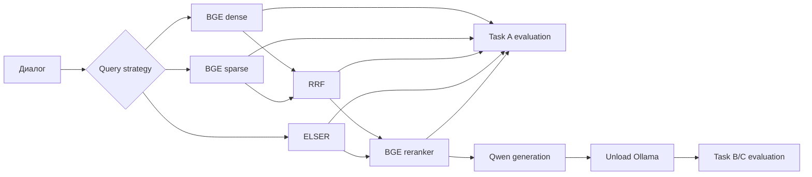

# MT-RAG

Локальный воспроизводимый multi-turn RAG для
[IBM MT-RAG Benchmark](https://github.com/IBM/mt-rag-benchmark). Проект сравнивает
BGE-M3 и ELSER, поддерживает query rewriting и трёхролевой history agent,
переранжирует документы BGE-reranker-v2-m3 и генерирует ответы локальной Qwen
через Ollama.

## Архитектура



Это не жёстко заданная цепочка. `configs/experiment.toml` объявляет:

- `queries` — last turn, gold rewrite, Qwen rewrite или agentic resolution;
- `pipelines` — BGE либо ELSER и доступные retrieval-выходы;
- `generation` — Task B/C jobs и источник passages;
- `schedules` — какие независимые результаты нужно получить за один запуск.

`PlanBuilder` рекурсивно разворачивает только запрошенные выходы, переиспользует
общие зависимости и строит DAG. Например, RRF зависит от dense и sparse,
reranker — от RRF или ELSER base, а Task C — от выбранного reranked-контекста.
Готовый граф сохраняется один раз; worker-процессы получают конкретную стадию и
не перестраивают schedule заново.

### Параллелизм и возобновление

- Все готовые по зависимостям CPU/Elasticsearch-стадии запускаются параллельно,
  пока хватает `run.cpu_slots`.
- GPU имеет один эксклюзивный слот: две CUDA/Ollama-стадии одновременно не
  запускаются. CPU retrieval может идти параллельно одной GPU-стадии
- При `cpu_slots = 4` retrieval резервирует 3 слота, обычная либо GPU-стадия —
  1 слот. Поэтому один ES retrieval может пересекаться с GPU inference, но два
  retrieval одновременно не стартуют.
- checkpoint JSONL и SQLite cache позволяют продолжить прерванный запуск. 
- Thermal guard приостанавливает работу при GPU `>=86°C` или CPU `>=90°C` и
  продолжает после устойчивого охлаждения до `72°C`/`80°C`.

## Требования

Основная конфигурация рассчитана на NVIDIA GPU с CUDA, 16 ГБ RAM и
локальный Docker. Индексация корпусов выполнялась отдельно; локально нужны уже
готовые Elasticsearch snapshots.

Установка системных зависимостей:

```bash
sudo systemctl enable --now docker
git lfs install
uv python install 3.12
```

GPU проверяется командой `nvidia-smi`.

Клонируйте benchmark рядом с проектом:

```bash
git clone https://github.com/IBM/mt-rag-benchmark ../mt-rag-benchmark
git lfs pull
cp .env.example .env
make sync-experiment
```

`make sync-experiment` устанавливает базовые, ML- и evaluation-зависимости.
Более лёгкие варианты: `make sync`, `make sync-ml`, `make sync-evaluation`.
Python-пакеты и точные версии закреплены в `pyproject.toml` и `uv.lock`.

## Модели и сервисы

### Ollama и Qwen

Ollama работает на host, а не в Docker, чтобы напрямую использовать NVIDIA GPU:

```bash
make ollama-enable
make ollama-pull
```

Используется `qwen3.5:4b-q4_K_M`; digest, context window и seed закреплены в
`configs/experiment.toml`. Освободить VRAM вручную:

```bash
make ollama-unload
```

### BGE encoder и reranker

```bash
make models-bge
make models-reranker
# или обе модели:
make models
```

### Elasticsearch

Elasticsearch 9 доступен только на `127.0.0.1:9200`:

```bash
make es-up
make es-logs
# остановка:
make es-down
```

Snapshots должны лежать так:

```text
artifacts/elasticsearch/snapshots/
├── elser/
└── bge-m3/
    ├── dense/{clapnq,cloud,govt,fiqa}/
    └── sparse/{clapnq,cloud,govt,fiqa}/
```

Восстановление BGE-индексов:

```bash
make bge-restore
```

Можно ограничить домены и режимы через argparse:

```bash
uv run python scripts/restore_bge_indices.py \
  --domains clapnq cloud \
  --modes dense
```

Настройка ELSER:

```bash
make elser-setup
```

Команда проверяет snapshot, активирует локальный Elastic trial, создаёт ELSER
inference endpoint и восстанавливает четыре индекса. BGE retrieval trial не
требует.

## Конфигурация поиска

Текущие значения находятся в `configs/experiment.toml`:

- BGE dense: top-50, `int8_hnsw`, 500 ANN candidates, float rescoring top-100;
- BGE sparse: top-50;
- RRF: top-20, `rank_constant = 60`;
- ELSER: top-20;
- reranker: top-20 → top-10;
- Task A prediction: top-10;
- генератор: top-5 passages, temperature `0.1`.

## Запуск эксперимента

Стандартная последовательность:

```bash
make experiment-plan EXPERIMENT_SCHEDULE=bge RUN_DIR=runs/main
make experiment-preflight EXPERIMENT_SCHEDULE=bge RUN_DIR=runs/main
make experiment-run EXPERIMENT_SCHEDULE=bge RUN_DIR=runs/main
make experiment-status EXPERIMENT_SCHEDULE=bge RUN_DIR=runs/main
make experiment-results RUN_DIR=runs/main
```

Повторный `experiment-run` возобновляет тот же schedule и переиспользует
совместимые fingerprinted artifacts.

### Argparse CLI

Главная точка входа:

```bash
uv run --extra ml --extra evaluation python scripts/run_experiment.py COMMAND [OPTIONS]
```

| Command | Назначение | Аргументы | Make |
|---|---|---|---|
| `plan` | показать DAG | `--config`, `--run-dir`, `--schedule` | `experiment-plan` |
| `preflight` | проверить сервисы, модели и индексы | те же | `experiment-preflight` |
| `run` | запустить или продолжить DAG | те же | `experiment-run` |
| `status` | показать состояния стадий schedule | те же | `experiment-status` |
| `results` | вывести все сохранённые метрики | `--config`, `--run-dir` | `experiment-results` |

Переменные Makefile соответствуют argparse:

```bash
make experiment-run \
  EXPERIMENT_CONFIG=configs/experiment.toml \
  EXPERIMENT_SCHEDULE=task_c_elser_agentic_reranked \
  RUN_DIR=runs/main
```

Основные schedules:

| Schedule | Что выполняет |
|---|---|
| `bge` | Task A для BGE dense/sparse/RRF/reranked и gold control |
| `elser` | Task A для ELSER last/Qwen и reranked вариантов |
| `task_b` | generation/evaluation на reference passages |
| `task_c_bge_last_rrf_reranked` | BGE last → RRF → reranker → Task C |
| `elser_agentic_reranked` | agentic resolution → ELSER → reranker → Task A |
| `task_c_elser_last_reranked` | last turn → ELSER → reranker → Task C |
| `task_c_elser_agentic_reranked` | agentic resolution → ELSER → reranker → Task A/C |

Live log конкретной стадии:

```bash
tail -f runs/main/logs/<stage-name>.log
```

## Официальная оценка

Task A:

```bash
uv run --extra evaluation python scripts/evaluate_retrieval.py \
  --input path/to/task-a.jsonl \
  --output path/to/task-a-metrics.json \
  --benchmark-root ../mt-rag-benchmark \
  --cutoffs 1 3 5 10
```

Task B/C с оптимизированным batched BERTScore:

```bash
uv run --extra evaluation python scripts/evaluate_generation.py \
  --input path/to/predictions.jsonl \
  --output path/to/ibm-metrics.jsonl \
  --summary path/to/ibm-summary.json \
  --device cuda:0 \
  --batch-size 1
```

Дополнительные аргументы generation evaluator: `--model`, `--chunk-size` и
`--limit`. Внутри используется официальный IBM `run_algorithmic_judges`; локально
оптимизирована только загрузка и пакетная работа BERTScore/DeBERTa.

## Структура проекта

```text
configs/experiment.toml       запросы, pipelines, jobs и schedules
scripts/run_experiment.py     argparse CLI и запуск scheduler
src/mtrag/experiments/        DAG builder и stage executors
src/mtrag/runtime/            scheduler, state, cache, thermal guard
src/mtrag/retrieval/          BGE/ELSER/RRF adapters
src/mtrag/reranking/          BGE cross-encoder
src/mtrag/llm/                Ollama client, prompts, rewriter и history agent
src/mtrag/evaluation/         адаптеры официальной IBM evaluation
```